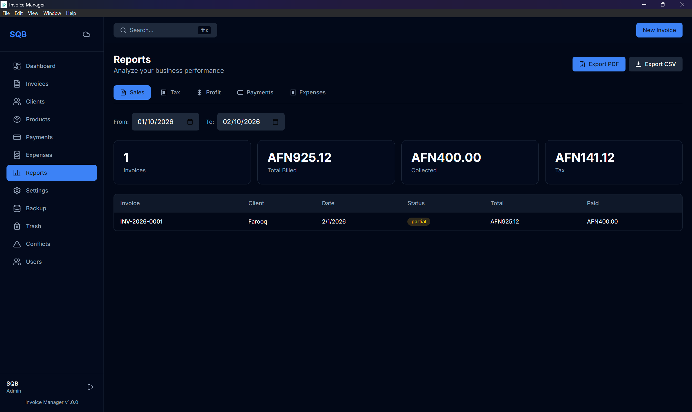

<p align="center">
  
</p>

<h1 align="center">Invoice & Revenue Manager</h1>

<p align="center">
  A production-ready, offline-first desktop application for managing invoices, tracking revenue, and analyzing business performance — built with <strong>Electron</strong>, <strong>React</strong>, and <strong>TypeScript</strong>.
</p>

<p align="center">
  
  
  
  
  
  
  
  
</p>

---

##  Features

### Core Invoicing

-  **Invoice Management** — Create, edit, duplicate, and void invoices with multi-line items, taxes, and discounts
-  **PDF Generation** — Professional invoice PDFs with Classic & Modern templates (A4 / Letter)
-  **Receipt PDFs** — Generate payment receipts for clients
-  **Report PDFs** — Export sales, tax, profit, payment, and expense reports as PDFs

### Financial Tracking

-  **Payments** — Record partial payments and refunds with multiple methods (Cash, Bank, Card, Check)
-  **Expense Tracking** — Log expenses by category with vendor and tax tracking
-  **Dashboard** — Revenue KPIs, monthly charts, invoice status breakdown, top clients, and recent activity
-  **Reports** — Sales, Tax, Profit, Payments, and Expenses analytics with date range filtering

### Client & Product Management

-  **Clients** — Full client database with billing/shipping addresses and tax numbers
-  **Products** — Product catalog with SKU, units, pricing, cost tracking, and optional stock management

### Data & Security

-  **Offline-First** — All data stored locally in SQLite (via sql.js) — no internet required
-  **Cloud Sync** — Optional Firebase Firestore sync with auto-sync, manual sync, and conflict resolution
-  **Multi-Tenant** — Mother/child user hierarchy per organization with role-based Firestore rules
-  **User Management** — Invite and manage team members within your organization
-  **Authentication** — Firebase Auth with email/password login and registration
-  **Backup/Restore** — Encrypted backups with optional password protection
-  **CSV Import/Export** — Import clients & products, export any data as CSV
-  **Trash & Recovery** — Soft-delete with restore or permanent deletion
-  **Audit Logging** — Track all CRUD operations for accountability

### User Experience

-  **Bilingual** — Full English and Dari (فارسی) translations with RTL support
-  **Theming** — Dark, Light, and System theme modes
-  **Interactive Tutorial** — Guided onboarding walkthrough using driver.js
-  **Keyboard Shortcuts** — Quick access to common actions
-  **Global Search** — Search across invoices, clients, and products (Ctrl+K)

---

##  Screenshots

<table>
  <tr>
    <td align="center"><br /><b>Dashboard</b> — Revenue KPIs, charts & activity</td>
    <td align="center"><br /><b>Invoice Editor</b> — Create & edit invoices</td>
  </tr>
  <tr>
    <td align="center"><br /><b>Client Management</b> — Add & manage clients</td>
    <td align="center"><br /><b>Reports</b> — Sales, tax & profit analytics</td>
  </tr>
  <tr>
    <td align="center"><br /><b>PDF Export</b> — Professional financial reports</td>
    <td align="center"><br /><b>دری / Persian</b> — Full RTL & light mode support</td>
  </tr>
</table>

---

##  Prerequisites

- **Node.js** 18.x or 20.x LTS
- **npm** 9.x or later
- **Windows** (primary target, packaged as `.exe`)

---

##  Getting Started

```bash
# Clone the repository
git clone <repo-url>
cd invoice

# Install dependencies
npm install

# If native module errors occur:
npm run postinstall
```

### Development

```bash
# Start the Vite dev server + TypeScript watcher
npm run dev

# In a separate terminal, launch Electron
npm start
```

The Vite dev server runs on **<http://localhost:5173>** and the Electron window loads from it in dev mode.

### Production Build

```bash
# Build both main process and renderer
npm run build

# Create Windows installer (.exe via NSIS)
npm run dist
```

The installer is output to the `release/` directory.

---

##  Architecture

```
invoice/
├── src/
│   ├── main/                   # Electron Main Process
│   │   ├── index.ts            # Electron app entry, window creation
│   │   ├── preload.ts          # Context bridge & IPC API exposure
│   │   ├── database/           # SQLite init, schema, migrations
│   │   ├── ipc/                # IPC handlers (one per domain)
│   │   │   ├── auth.ipc.ts
│   │   │   ├── invoices.ipc.ts
│   │   │   ├── clients.ipc.ts
│   │   │   ├── products.ipc.ts
│   │   │   ├── payments.ipc.ts
│   │   │   ├── expenses.ipc.ts
│   │   │   ├── dashboard.ipc.ts
│   │   │   ├── reports.ipc.ts
│   │   │   ├── backup.ipc.ts
│   │   │   └── settings.ipc.ts
│   │   └── pdf/                # PDF generators
│   │       ├── invoice-pdf.ts  # Invoice PDFs (Classic/Modern)
│   │       ├── receipt-pdf.ts  # Payment receipt PDFs
│   │       └── report-pdf.ts   # Report PDFs
│   │
│   ├── renderer/               # React Frontend (Vite)
│   │   ├── App.tsx             # Root component, routing, context
│   │   ├── main.tsx            # React entry point
│   │   ├── pages/              # Page components
│   │   │   ├── Dashboard.tsx
│   │   │   ├── Invoices.tsx
│   │   │   ├── InvoiceEditor.tsx
│   │   │   ├── Clients.tsx
│   │   │   ├── Products.tsx
│   │   │   ├── Payments.tsx
│   │   │   ├── Expenses.tsx
│   │   │   ├── Reports.tsx
│   │   │   ├── Settings.tsx
│   │   │   ├── Backup.tsx
│   │   │   ├── Login.tsx
│   │   │   ├── Register.tsx
│   │   │   ├── ManageUsers.tsx
│   │   │   ├── Conflicts.tsx
│   │   │   └── Trash.tsx
│   │   ├── components/         # Reusable UI components
│   │   │   ├── layout/         # App shell, sidebar, navigation
│   │   │   ├── Toast.tsx       # Toast notifications
│   │   │   ├── ConfirmButton.tsx
│   │   │   └── Tutorial.tsx    # Onboarding tutorial
│   │   ├── contexts/           # React Context providers
│   │   │   ├── AuthContext.tsx       # Firebase authentication
│   │   │   ├── LanguageContext.tsx   # i18n (en/fa) with RTL
│   │   │   ├── SyncContext.tsx       # Cloud sync state
│   │   │   └── ThemeContext.tsx      # Dark/Light/System theme
│   │   ├── services/
│   │   │   └── syncService.ts  # Firebase Firestore sync logic
│   │   ├── lib/                # Utility libraries
│   │   ├── utils/              # Helper functions
│   │   └── styles/             # Global CSS
│   │
│   └── shared/                 # Shared between main & renderer
│       ├── types.ts            # TypeScript interfaces & types
│       ├── constants.ts        # App-wide constants
│       └── schemas/            # Zod validation schemas
│           ├── invoice.schema.ts
│           ├── client.schema.ts
│           ├── product.schema.ts
│           ├── payment.schema.ts
│           ├── expense.schema.ts
│           └── settings.schema.ts
│
├── resources/                  # App icons & assets
├── dist/                       # Build output
├── release/                    # Packaged installers
├── firestore.rules             # Firebase security rules
├── firebase.json               # Firebase project config
├── tailwind.config.js          # Tailwind CSS configuration
├── vite.config.ts              # Vite bundler config
├── tsconfig.json               # Base TypeScript config
├── tsconfig.main.json          # Main process TS config
└── tsconfig.node.json          # Node/Vite TS config
```

### Process Architecture

```
┌───────────────────────────────────────────────────┐
│                  Electron Main                    │
│    ┌────────────┐  ┌──────────┐  ┌──────────────┐ │
│    │  SQLite DB │  │ IPC Hub  │  │ PDF Engine   │ │
│    │ (sql.js)   │  │ 10 mods  │  │ (pdf-lib)    │ │
│    └──────┬─────┘  └────┬─────┘  └──────────────┘ │
│           └─────────────┼─────────────────────────│
│                   contextBridge                   │
├───────────────────────────────────────────────────┤
│                Electron Renderer                  │
│  ┌──── ─────┐  ┌───────────┐  ┌────────────────┐  │
│  │  React   │  │ Contexts  │  │  Firebase SDK  │  │
│  │  Pages   │  │ Auth/Sync │  │  Auth + Sync   │  │
│  │  (15)    │  │ Lang/Theme│  │  Firestore     │  │
│  └──────────┘  └───────────┘  └────────────────┘  │
└───────────────────────────────────────────────────┘
```

---

## ⌨️ Keyboard Shortcuts

| Shortcut   | Action            |
|------------|-------------------|
| `Ctrl+N`   | New Invoice       |
| `Ctrl+K`   | Global Search     |
| `Ctrl+S`   | Save (in editors) |
| `Ctrl+P`   | Export PDF        |
| `Escape`   | Close modals      |

---

##  Cloud Sync (Optional)

The app works fully offline. Cloud sync is **optional** and uses Firebase:

1. **Authentication** — Email/password via Firebase Auth
2. **Data Sync** — Firestore with multi-tenant isolation (each org's data is separated)
3. **Auto-Sync** — Syncs every 30 minutes when enabled
4. **Conflict Resolution** — Dedicated UI to compare local vs. cloud versions and choose which to keep
5. **User Roles** — "Mother" (admin) accounts create the organization; "Child" users are invited members

> Configure Firebase by updating `firebase.json` and deploying `firestore.rules` for security.

---

##  Customization

| What | Where |
|------|-------|
| Company Logo | Settings → Company → Choose Logo |
| Invoice Templates | `src/main/pdf/invoice-pdf.ts` (Classic/Modern) |
| Receipt Templates | `src/main/pdf/receipt-pdf.ts` |
| Tax Rates | Settings → Tax Rates |
| Currency & Format | Settings → Invoice Settings |
| Theme | Settings → Appearance (Dark / Light / System) |
| Language | Settings → Language (English / دری) |
| Database Path | `%APPDATA%/invoice-manager/data.db` |

---

##  Scripts Reference

| Script | Description |
|--------|-------------|
| `npm run dev` | Start dev mode (Vite + TS watcher) |
| `npm start` | Launch Electron |
| `npm run build` | Build main + renderer for production |
| `npm run dist` | Build + create Windows installer (.exe) |
| `npm run lint` | Run ESLint |
| `npm run test` | Run tests (Vitest) |

---

##  Tech Stack

| Layer | Technology |
|-------|-----------|
| Desktop Shell | [Electron](https://www.electronjs.org/) 28 |
| Frontend | [React](https://react.dev/) 18 + [TypeScript](https://www.typescriptlang.org/) 5 |
| Styling | [Tailwind CSS](https://tailwindcss.com/) 3.4 + [tailwindcss-animate](https://github.com/jamiebuilds/tailwindcss-animate) |
| State Management | [Zustand](https://zustand-demo.pmnd.rs/) + React Context |
| Forms | [React Hook Form](https://react-hook-form.com/) + [Zod](https://zod.dev/) |
| Database | [sql.js](https://sql.js.org/) (SQLite compiled to WASM) |
| Charts | [Recharts](https://recharts.org/) |
| PDF Generation | [pdf-lib](https://pdf-lib.js.org/) |
| Icons | [Lucide React](https://lucide.dev/) |
| Auth & Sync | [Firebase](https://firebase.google.com/) (Auth + Firestore) |
| Encryption | [CryptoJS](https://github.com/brix/crypto-js) (backup encryption) |
| Onboarding | [Driver.js](https://driverjs.com/) |
| Routing | [React Router](https://reactrouter.com/) 6 |
| Build Tool | [Vite](https://vitejs.dev/) 5 |
| Packaging | [electron-builder](https://www.electron.build/) |
| Testing | [Vitest](https://vitest.dev/) |

---

##  License

This project is licensed under the [MIT License](LICENSE).
